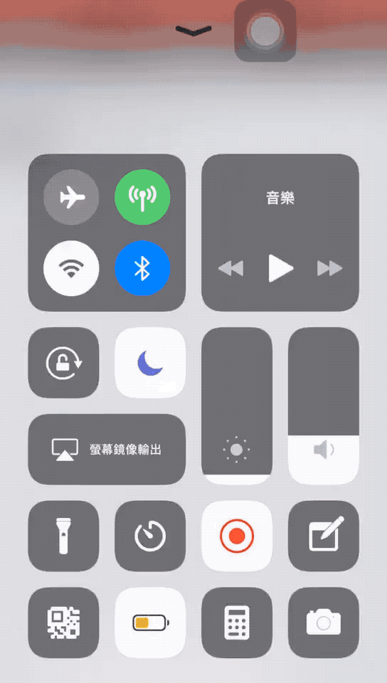

# mp-music

## Introduction

微信公众号接入音乐 API

其实应该很多人都做过了。只是无聊又想给自己的订阅号接入一下。

## Run

```python
git clone [repo]
pipenv install
```

~~在 `config/setting.py` 下新增 TOKEN='xxxx' 与公众号配置的 TOKEN 一致。~~

在 `app/config` 目录下新建 `secure.py`  新增 TOKEN='xxxx' 与公众号配置的 TOKEN 一致

```sh
pipenv shell
python manage.py
```

## Deploy

`mpmusic` 为 nginx 配置文件放置于 `/etc/nginx/sites-enabled/mpmusic`

`mpmusic.conf` 为 supervisor 配置文件放置于 `/etc/supervisor/conf.d/mpmusic.conf`

> 为了让 Click 在 Unix 以及 Python3 环境下能够正确处理编码问题，我们需要将环境变量 LC_ALL 和 LANG 设为 C.UTF-8 或 en_US.UTF-8，在 supervisord.conf 配置文件写入 -- 参考 《flask web 开发实战》

```shell
sudo vim /etc/supervisor/supervisord.conf
```

```shell
# 在 [supervisord] 下面添加
environment=LC_ALL='en_US.UTF-8',LANG='en_US.UTF-8'
```

## Demo



## Change Log

- Tue Apr  2 02:13:13 first version

## Acknowledgement

- [music-dl](https://github.com/0xHJK/music-dl)
